<div align="center">

# Slide AI — Frontend

**AI-powered presentation studio.** Describe an idea, pick a theme, and present in minutes.

React 19 · TypeScript · Vite 7 · Tailwind v4 · Framer Motion

</div>

---

## ✨ Features

- **AI generation** — one prompt produces a full structured deck (real DeepSeek LLM, not templates).
- **15 live themes** — swap palettes/fonts with an instant whole-deck preview.
- **Inline editor** — single source of truth (`EditorProvider`), undo/redo, autosave, version history.
- **AI chat assistant** — multi-turn agent that edits the deck via tool calls (`change_theme`, `add_slide`, `update_slide`, `reduce_text`…).
- **Present mode** — true fullscreen with cover-scaled slides, theme-aware transitions, keyboard nav, touch swipe.
- **Templates** — 8 curated deck structures (startup pitch, finance, education, marketing…).
- **Assets library** — search Unsplash images and inline SVG icons.
- **Workspaces** — share decks, invite members, role-based access (owner/admin/editor/viewer), audit log.
- **Sharing** — public, private, or password-protected links.
- **Export** — HTML (interactive viewer with slide navigation), PDF (vector via Playwright), PPTX (native).
- **Settings** — theme mode, default slide count/tone/language, autosave delay, animations toggle.

---

## 🖼️ Screenshots

### Home / Landing
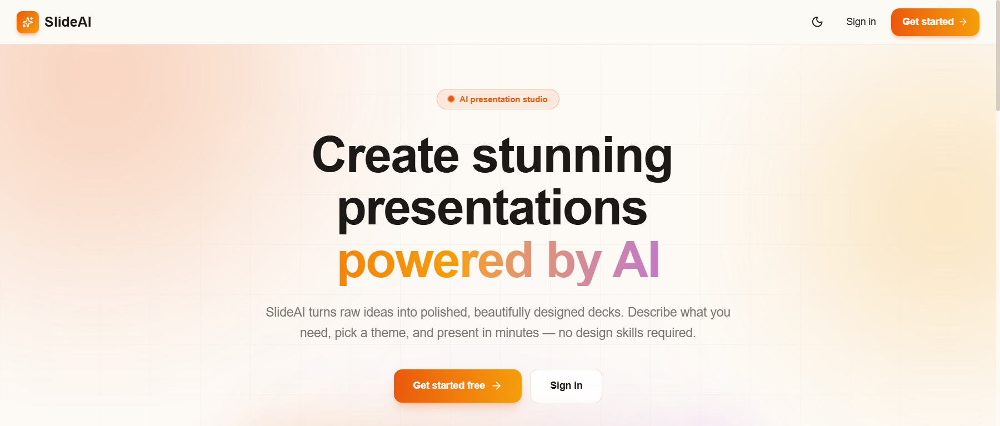

### Authentication
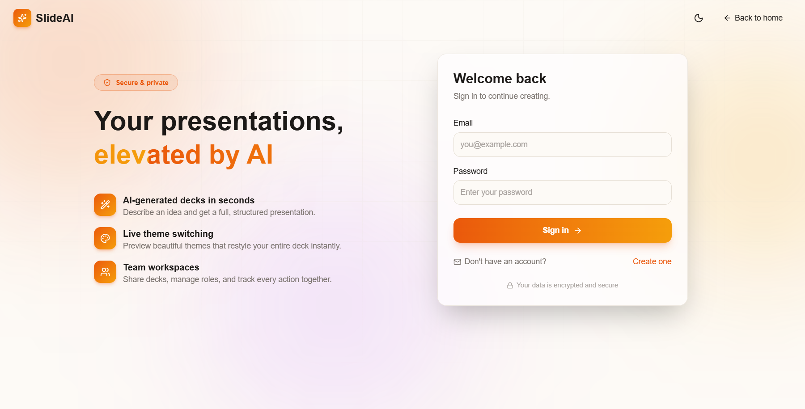

### Dashboard
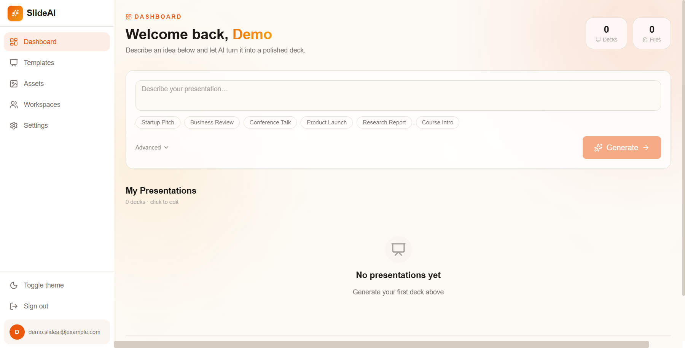

### Theme picker (live preview before generation)
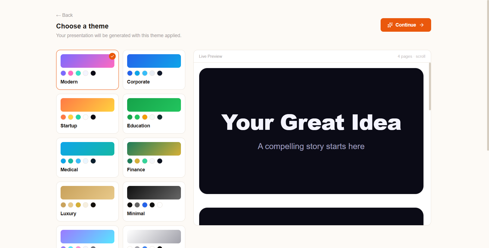

### Editor — hero slide
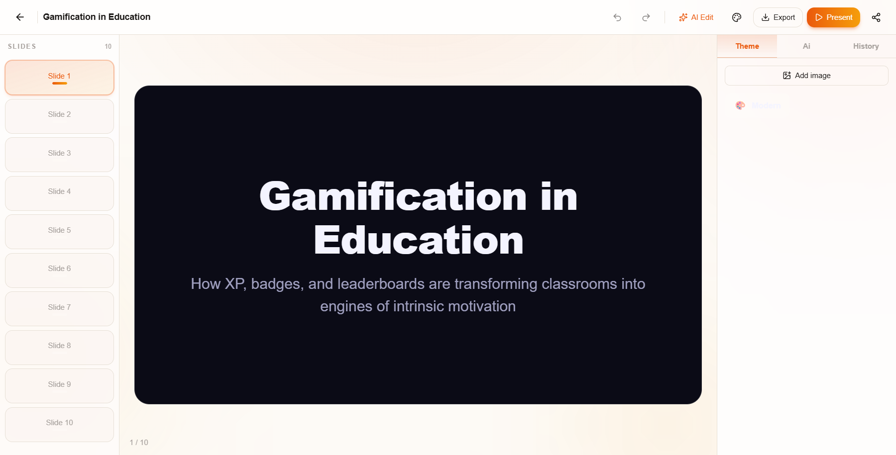

### Editor — statistics slide + AI panel
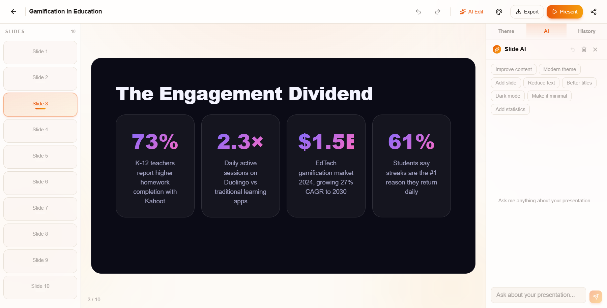

### Editor — comparison slide
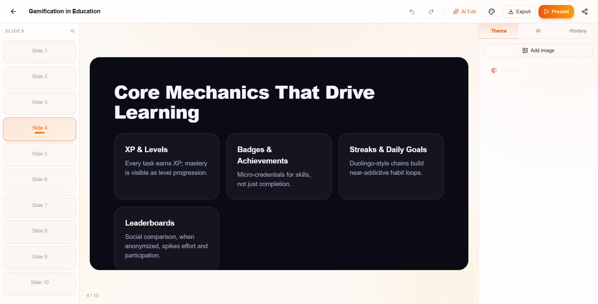

### Present mode (fullscreen, cover-scaled)
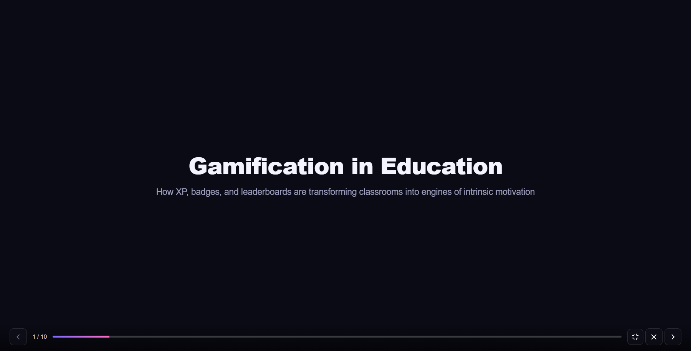

### Templates browser
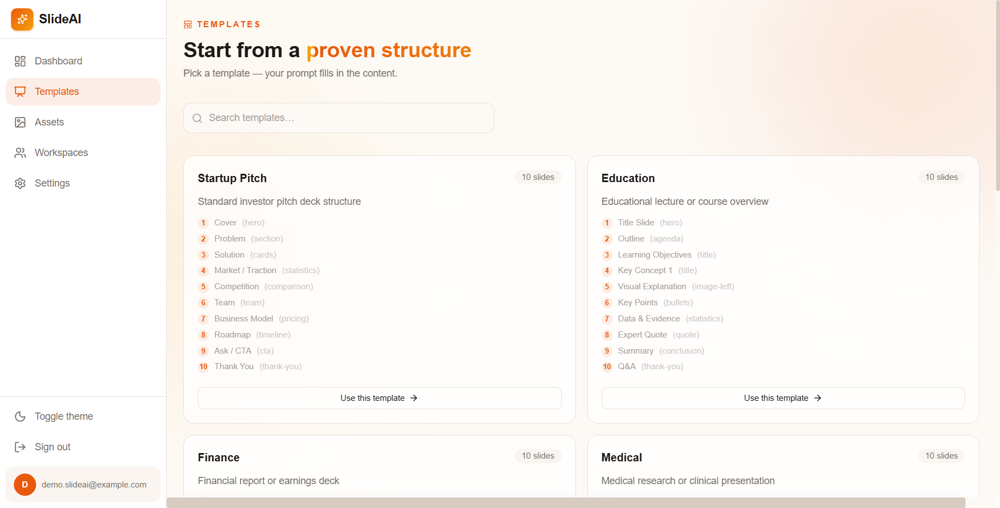

### Assets library
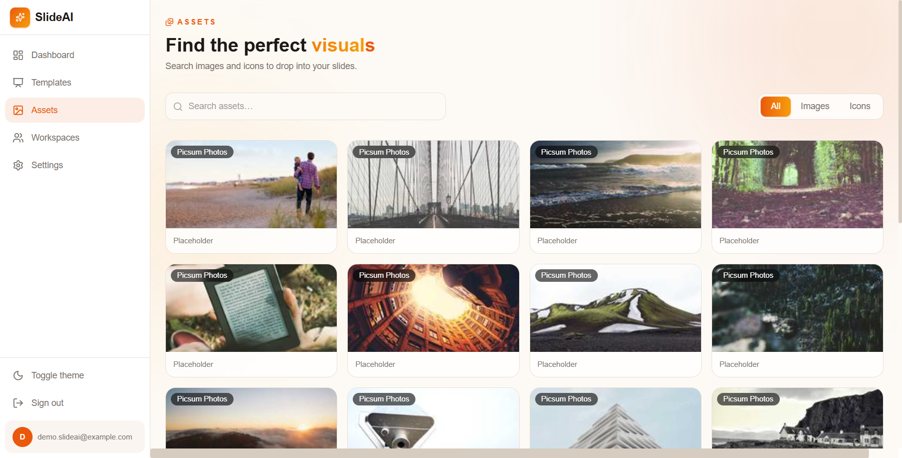

### Workspaces
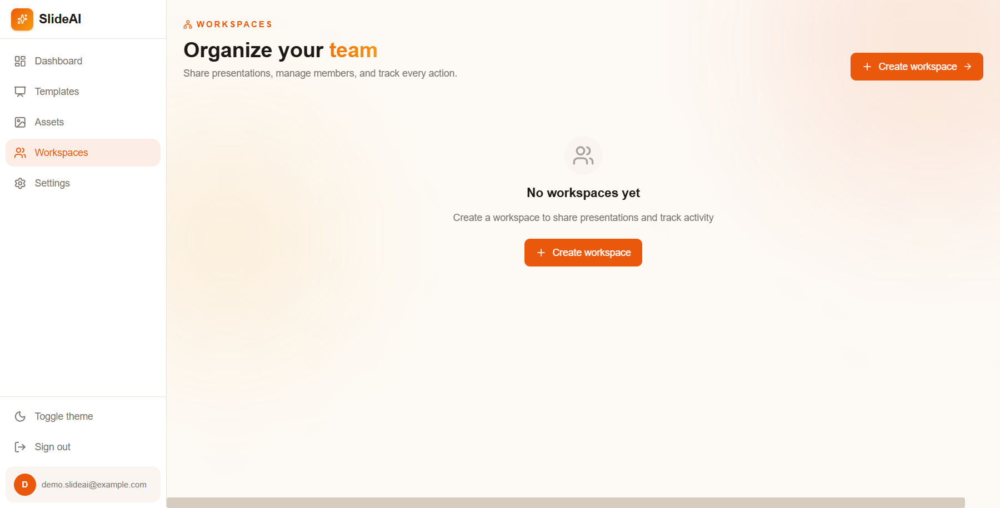

### Settings
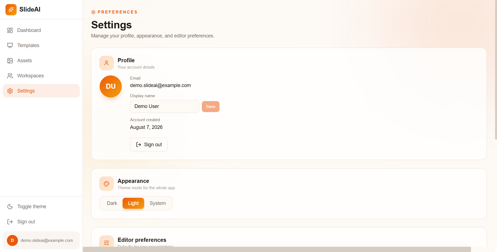

---

## 🏗️ Tech stack

| Layer | Tech |
|-------|------|
| Framework | React 19 |
| Language | TypeScript 5.9 |
| Build | Vite 7 |
| Styling | Tailwind CSS v4 + custom tokens |
| Animation | Framer Motion |
| Routing | React Router v7 |
| Icons | lucide-react |
| Markdown | react-markdown + remark-gfm |
| State | React Context (Auth, Theme, Editor, Chat) |
| API client | Typed `fetch` wrapper in `src/lib/api.ts` |

---

## 🚀 Getting started

### Prerequisites
- Node.js ≥ 20
- The [slide-ai-backend](https://github.com/zakaria0n/slide-ai-backend) running on `http://localhost:8000`

### Install & run

```bash
npm install
npm run dev
```

The Vite dev server proxies `/api/**` to `http://localhost:8000` (see `vite.config.ts`) so no CORS setup is needed locally.

### Build

```bash
npm run build    # tsc -b + vite build
npm run preview  # serve the production build
```

---

## 📁 Project structure

```
src/
├── components/
│   ├── ai/                  # AiEditorPanel + ChatContext (streaming)
│   ├── auth/                # AuthLayout (shared login/signup shell)
│   ├── editor/              # EditorContext, EditableText, HistoryPanel,
│   │                        # ImagePickerModal, QuickAiEditModal
│   ├── renderer/            # SlideRenderer, Layouts (23), ElementRenderer,
│   │                        # AnimatedElement, MotionItem, FullscreenPlayer,
│   │                        # DeckThemeProvider, ThemeSwitcher
│   ├── theme/               # ThemePickerModal (pre-generation preview)
│   ├── ui/                  # Button, Card, Input, Modal, Badge, Toast,
│   │                        # Spinner, Skeleton, EmptyState, ConfirmDialog…
│   └── ShareModal.tsx       # Public / password / private sharing
├── context/                 # AuthContext, ThemeContext
├── layouts/                 # AppShell (sidebar), FullscreenShell, MarketingShell
├── lib/                     # api.ts (typed client), settings.ts, cn.ts
├── pages/                   # Home, Login, Signup, Dashboard, Editor, Present,
│                            # Shared, Templates, Assets, Workspaces, Settings, NotFound
├── types/                   # Shared TypeScript types
└── router.tsx               # Route table + auth guard
```

---

## 🔌 Backend contract

The frontend talks to the FastAPI backend at `/api/v1`. The full client is in `src/lib/api.ts`:

| Area | Endpoints |
|------|-----------|
| Auth | `POST /auth/signup` · `POST /auth/signin` · `POST /auth/signout` · `GET /auth/me` · `PATCH /auth/me` |
| Presentations | `GET/POST/PATCH/DELETE /presentations` · `POST /presentations/generate` · `GET/PUT /presentations/{id}/spec` |
| AI edit | `POST /presentations/{id}/edit` (non-streaming) |
| Chat | `GET /presentations/{id}/chat` · `POST /presentations/{id}/chat/stream` (SSE) · `DELETE` |
| Versions | `GET /presentations/{id}/versions` · `POST /versions/{id}/restore` |
| Files | `GET/POST /files` · `DELETE /files/{id}` · `GET /files/{id}/url` (signed) |
| Assets | `GET /assets/search` |
| Templates | `GET /templates` · `GET /templates/suggest` |
| Sharing | `POST /presentations/{id}/shares` · `GET /shared/{token}` |
| Workspaces | `GET/POST/PATCH/DELETE /workspaces` + members + invitations + audit |
| Export | `GET /presentations/{id}/export?format=html|pdf|pptx` |

---

## ⚙️ Configuration

No env vars required for the frontend. The dev proxy targets `http://localhost:8000` by default.

User preferences are persisted in `localStorage` under `slideai.settings`:
- `displayName`, `defaultSlideCount`, `defaultTone`, `defaultLanguage`
- `autosaveDelay` (1 / 3 / 5 seconds)
- `animationsEnabled` (toggles element cascades + slide transitions)

---

## 🎨 Theming

15 themes ship out of the box: `modern`, `corporate`, `startup`, `education`, `medical`, `finance`, `luxury`, `minimal`, `glass`, `dark`, `neon`, `apple`, `google`, `microsoft`, `openai`.

Each theme defines `bg / surface / surface2 / border / text / textMuted / textDim / accent / accent2 / accent3 / fontHeading / fontBody / radius / radiusLg / gradient` — see `src/components/renderer/theme.ts`.

The `DeckThemeProvider` makes the active theme available anywhere in the editor / viewer / present mode.

---

## 📦 Scripts

| Script | What it does |
|--------|--------------|
| `npm run dev` | Start Vite dev server with HMR |
| `npm run build` | Type-check + production build |
| `npm run preview` | Preview the production build locally |
| `npm run lint` | ESLint |

---

## 📄 License

MIT — built for people who present.
