<div align="center">

# Slide AI — Frontend

**AI-powered presentation studio.** Describe an idea, review the plan, edit like a canvas, and present in minutes.

React 19 · TypeScript · Vite 7 · Tailwind v4 · Framer Motion · Chart.js · Three.js

</div>

---

## ✨ Features

**Generation**
- **AI generation** — one prompt produces a full structured deck (charts, cards, timelines, AI-authored custom-coded slides).
- **Outline-first flow** — review, reorder, edit or drop the AI's slide plan *before* generating the full deck.
- **Model selection** — pick the AI model from Settings (free-tier friendly).
- **Templates** — 8 curated deck structures, auto-suggested from your prompt.
- **Import** — markdown, a web page URL, or an existing **.pptx file** (text, tables and native charts become editable elements — no AI rewriting).

**Editing (Canva-style)**
- **Free canvas** — drag, resize, nudge (arrows), duplicate, copy/paste every element.
- **Multi-select** — shift-click, group drag, and one-click align (6 modes).
- **Smart guides** — pink alignment lines snap elements to each other's edges and centers while dragging.
- **Native charts** — insert bar / line / pie / doughnut / radar charts, edit labels and data series inline.
- **Z-order & lock** — bring to front, send to back, lock elements against accidental edits.
- **Right-click context menu** and a **Ctrl+K command palette**.
- **Deck Doctor** — scan the whole deck for overflow, overlaps and truncation, then batch-fix with AI.
- **Version history** with one-click restore + optimistic locking (409-safe concurrent edits).
- **Speaker notes** with voice dictation + dual-screen presenter window (BroadcastChannel).

**Themes**
- **16 live themes** — swap palettes/fonts with an instant whole-deck preview.
- **Custom user themes** — create your own (colors, fonts, ambient motion), reuse them across decks; decks carry their tokens so they render identically everywhere.
- **Custom-coded slides** — AI writes real HTML/CSS/JS for showpiece slides, sandboxed with Chart.js + anime.js preloaded.
- **AI animations** — the model authors named `@keyframes` (validated by a real CSS parser) and applies them to elements.

**Present & share**
- **Present mode** — true fullscreen, cover-scaled slides, rehearsal timings, auto-play.
- **Translate deck** — every text translated in one AI call.
- **Sharing** — public / password / private links with **expiry** (24h → 30 days) and **iframe embed code**.
- **Analytics** — views, attention-per-slide, drop-off and reviewer comments per deck.
- **Export** — animated HTML, vector PDF (Playwright), native **PPTX with real editable charts**.
- **MCP page** — connect ZKR, Claude Code, Cursor, Codex, OpenCode and other AI agents to your decks (OAuth browser flow, no copy-pasting tokens).

**App**
- **Dark mode**, first-run **onboarding tour**, workspaces with roles and audit log, brand kit, reusable slide library, asset search (Unsplash + SVG icons).

---

## 🖼️ Screenshots

### Landing
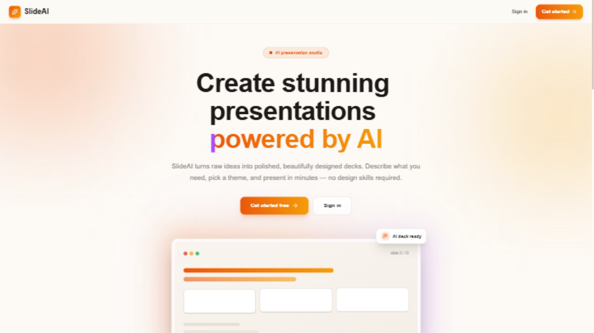

### Dashboard — generation bar, deck cards, quick actions
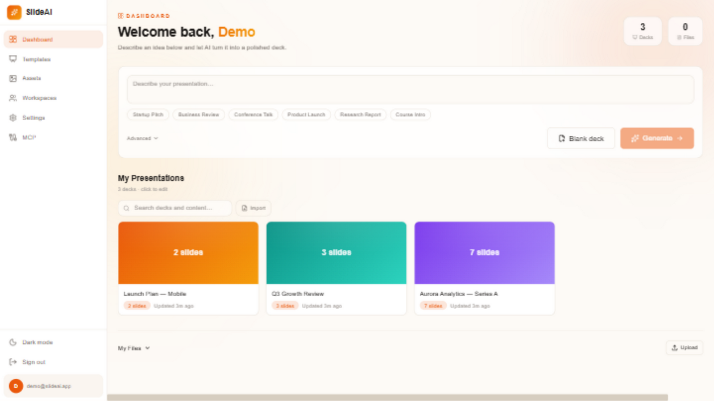

### Dashboard — dark mode
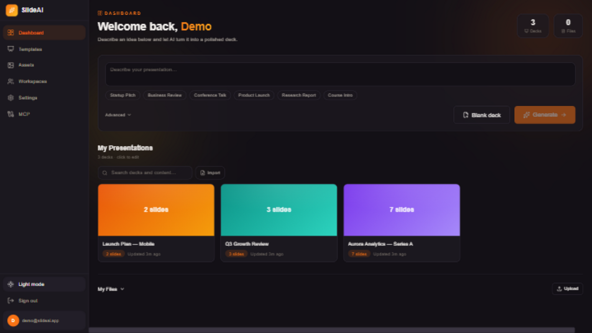

### Onboarding tour (first visit)
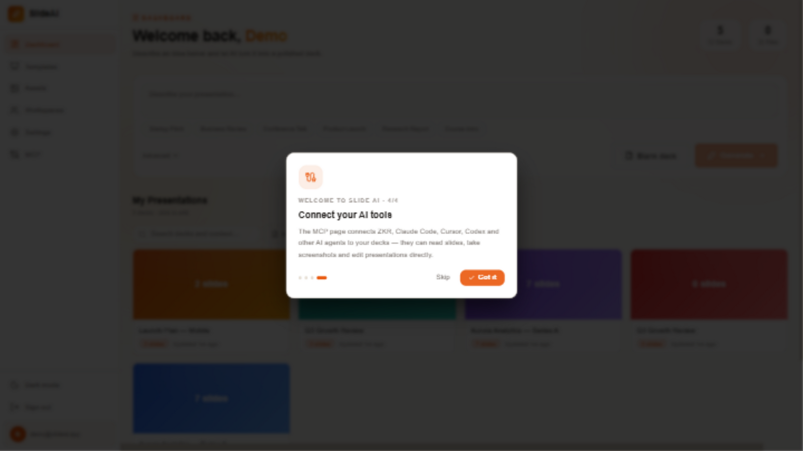

### Theme picker — 16 themes, outline-first, custom themes
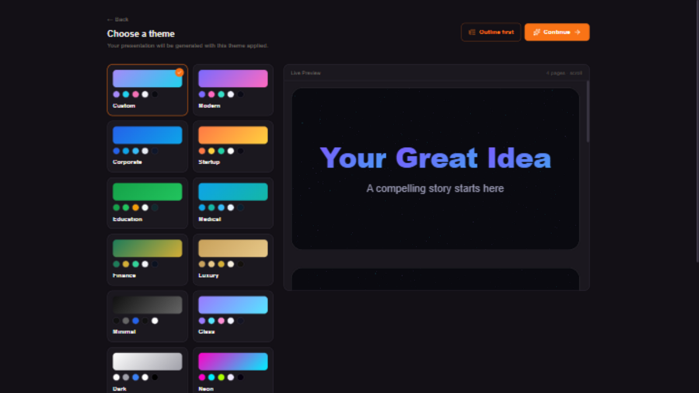

### Custom themes — your brand, saved and reusable
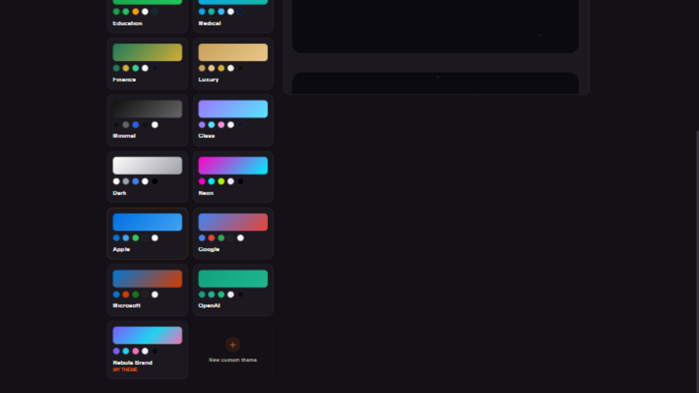

### Outline review — reorder/edit the plan before generating
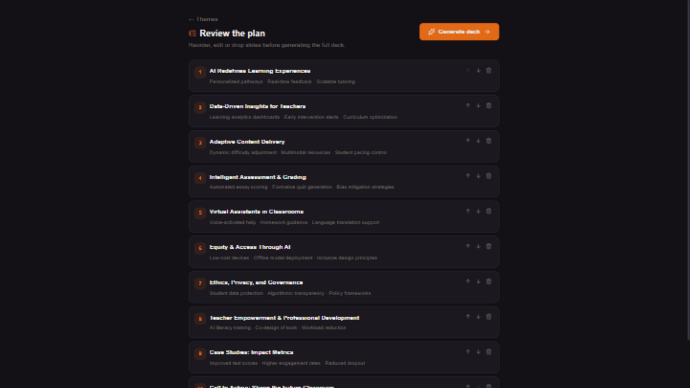

### Editor — native charts, canvas toolbar, AI panel
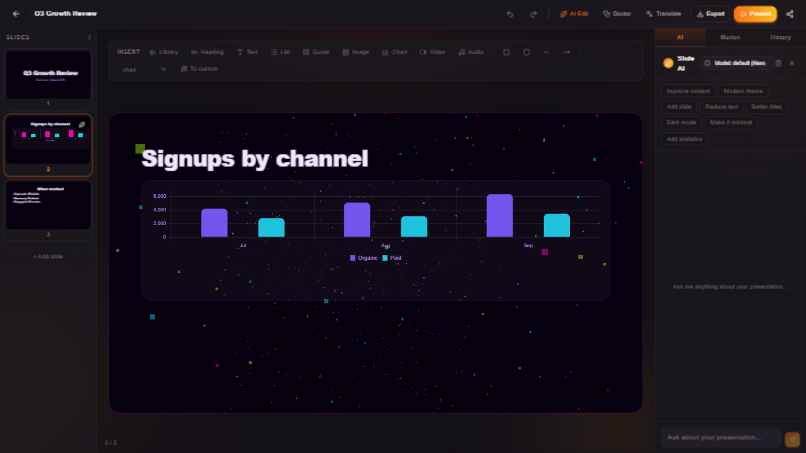

### Present mode — fullscreen with ambient motion
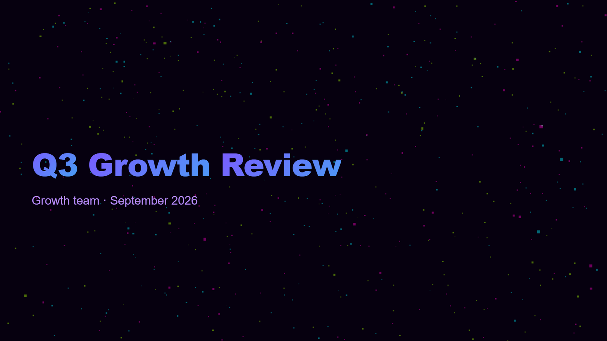

### Deck analytics — attention per slide, views, comments
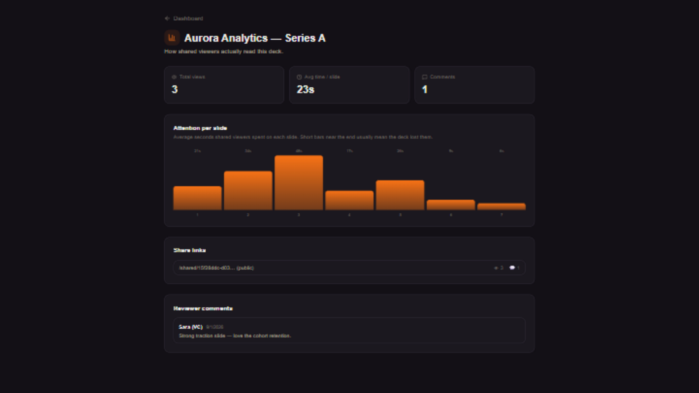

### MCP — connect AI coding agents to your decks
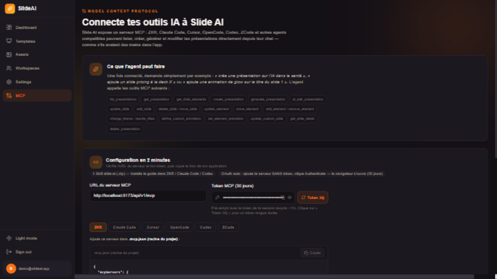

---

## 🏗️ Tech stack

| Layer | Tech |
|-------|------|
| Framework | React 19 |
| Language | TypeScript 5.9 |
| Build | Vite 7 |
| Styling | Tailwind CSS v4 + custom tokens |
| Animation | Framer Motion + anime.js |
| Charts | Chart.js (react-free, token-themed) |
| 3D ambient | Three.js (particles, auto-fallback to CSS) |
| Routing | React Router v7 |
| Icons | lucide-react |
| State | React Context (Auth, Theme, Editor, Chat) |
| API client | Typed `fetch` wrapper in `src/lib/api.ts` |

---

## 🚀 Getting started

### Prerequisites
- Node.js ≥ 20
- The [slide-ai-backend](https://github.com/zakaria0n/slide-ai-backend) running (default `http://localhost:8000`)

### Install & run

```bash
npm install
npm run dev
```

The Vite dev server proxies `/api/**` and `/.well-known/oauth` to the backend (see `vite.config.ts`) so no CORS setup is needed locally. If something else already listens on 8000, point the proxy elsewhere:

```bash
BACKEND_URL=http://localhost:8001 npm run dev
```

### Build

```bash
npm run build    # tsc -b + vite build
npm run preview  # serve the production build
```

---

## 📁 Project structure

```
src/
├── components/
│   ├── ai/                  # AiEditorPanel + ChatContext (streaming agent)
│   ├── editor/              # EditorContext (optimistic locking, history),
│   │                        # CanvasToolbar (insert/chart/align/lock),
│   │                        # FreeElementLayer helpers, CommandPalette,
│   │                        # EditorContextMenu, TranslateModal,
│   │                        # DeckDoctorModal, QuickAiEditModal…
│   ├── renderer/            # SlideRenderer (auto-fit), Layouts (30+),
│   │                        # ElementRenderer, DataChartView, ChartView,
│   │                        # CustomCodeFrame (sandboxed AI slides),
│   │                        # AmbientBackground (Three.js/CSS),
│   │                        # FullscreenPlayer, DeckThemeProvider,
│   │                        # ThemeSwitcher, FreeElementLayer
│   ├── theme/               # ThemePickerModal (preview + outline flow
│   │                        #  + custom theme creation)
│   ├── ui/                  # Button, Card, Input, Modal, Badge, Toast…
│   ├── OnboardingTour.tsx   # First-run 4-step welcome
│   └── ShareModal.tsx       # Links + expiry + embed code
├── context/                 # AuthContext, ThemeContext (light/dark)
├── layouts/                 # AppShell (sidebar), FullscreenShell, MarketingShell
├── lib/                     # api.ts (typed client), settings.ts, imageUrls.ts
├── pages/                   # Home, Login, Signup, Dashboard, Editor, Present,
│                            # Shared, Analytics, Templates, Assets, Workspaces,
│                            # Settings, Mcp, OAuth authorize, NotFound
├── types/                   # Shared TypeScript types (spec model)
└── router.tsx               # Route table + auth guard
```

---

## 🔌 Backend contract

The frontend talks to the FastAPI backend at `/api/v1`. The full client is in `src/lib/api.ts`:

| Area | Endpoints |
|------|-----------|
| Auth | `POST /auth/signup` · `POST /auth/signin` · `POST /auth/signout` · `GET /auth/me` · `PATCH /auth/me` · device flow + `POST /auth/mcp-token` |
| Presentations | `GET/POST/PATCH/DELETE /presentations` · `POST /presentations/generate` (supports `outline`, `theme_tokens`) · `POST /presentations/outline` · `GET/PUT /presentations/{id}/spec` (optimistic lock) |
| Import | `POST /presentations/import` (markdown/url) · `POST /presentations/import/pptx` (multipart) |
| AI edit | `POST /presentations/{id}/edit` · `POST /presentations/{id}/translate` |
| Chat | `GET /presentations/{id}/chat` · `POST /presentations/{id}/chat/stream` (SSE) · `DELETE` |
| Versions | `GET /presentations/{id}/versions` · `POST /versions/{id}/restore` |
| Files | `GET/POST /files` · `DELETE /files/{id}` · `GET /files/{id}/url` (signed) |
| Assets | `GET /assets/search` |
| Templates | `GET /templates` · `GET /templates/suggest` |
| Themes | `GET/POST /themes` · `DELETE /themes/{id}` (user-saved custom themes) |
| Brand kit | `GET/PUT /brand-kit` |
| Slide library | `GET/POST /slide-library` · `DELETE /slide-library/{id}` |
| Sharing | `POST/GET /presentations/{id}/shares` (expiry, password) · `DELETE /shares/{token}` · `GET /shared/{token}` · `POST /shared/{token}/analytics` · `POST /shared/{token}/comments` |
| Workspaces | CRUD + members + invitations + audit + user search |
| Export | `GET /presentations/{id}/export?format=html\|pdf\|pptx` |
| Models | `GET /models` |
| MCP | `POST /mcp` (JSON-RPC) + `/.well-known/oauth-*` discovery · `/skill/slide-ai.zip` |

---

## ⚙️ Configuration

No env vars required for the frontend. The dev proxy targets `http://localhost:8000` by default (`BACKEND_URL` to override).

User preferences are persisted in `localStorage` under `slideai.settings`:
- `displayName`, `defaultSlideCount`, `defaultTone`, `defaultLanguage`
- `autosaveDelay` (1 / 3 / 5 seconds)
- `animationsEnabled` (toggles element cascades + slide transitions)
- app theme (`slideai.app-theme`: `light` / `dark`)

---

## 🎨 Theming

**Deck themes** — 16 ship out of the box: `custom`, `modern`, `corporate`, `startup`, `education`, `medical`, `finance`, `luxury`, `minimal`, `glass`, `dark`, `neon`, `apple`, `google`, `microsoft`, `openai`.

Each theme defines `bg / surface / surface2 / border / text / textMuted / textDim / accent / accent2 / accent3 / fontHeading / fontBody / radius / radiusLg / gradient / energy / ambient` — see `src/components/renderer/theme.ts`. The `DeckThemeProvider` resolves tokens (and merges `meta.themeTokens` for user-saved themes) for the editor, viewer and present mode.

**App chrome** — light/dark toggle in the sidebar; dark mode overrides the Tailwind v4 `--color-*` variables under `html.dark` (see `src/index.css`), independent from deck themes.

---

## 📦 Scripts

| Script | What it does |
|--------|--------------|
| `npm run dev` | Start Vite dev server with HMR |
| `npm run build` | Type-check + production build |
| `npm run preview` | Preview the production build locally |
| `npm run lint` | ESLint |

---

## 📄 License

MIT — built for people who present.
